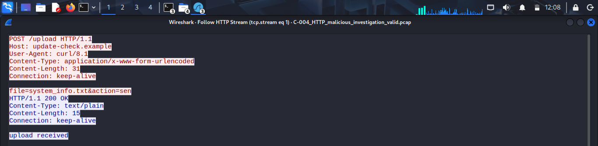

# C-004-malicious-http-investigation
SOC investigation of malicious HTTP activity involving system information transfer and executable-like payload delivery, analyzed using Wireshark and network forensic techniques.

# C-004 — Malicious HTTP Activity Investigation

## Investigation Overview
This investigation examines a suspicious HTTP communication pattern identified in a Wireshark PCAP. The investigation focuses on communication between a workstation and a remote server, including the transfer of system information and the subsequent retrieval of an executable-like file.

The purpose of the investigation is to analyze the available network evidence and determine whether the observed activity is normal, suspicious, or malicious.

## Investigation Objective
The objective of this investigation is to analyze the HTTP traffic between the affected workstation and the remote server, identify the activities carried out during the communication, examine the transfer of system information and executable-like content, and determine whether the observed activity should be classified as normal, suspicious, or malicious.

## Evidence Used
The primary evidence used for this investigation was a Wireshark PCAP file containing the network traffic generated during the incident.

The investigation also involved analysis of HTTP requests and responses, TCP stream data, and HTTP objects extracted from the PCAP.

## Network Information

- Source IP: `10.0.2.15`
- Destination IP: `198.51.100.23`
- Protocol: `HTTP`
- Destination Port: `80`
- Host: `update-check.example`
- User-Agent: `curl/8.1`

## Initial Observations
The initial review of the PCAP revealed several activities that required further investigation:

1. The workstation `10.0.2.15` initiated HTTP communication with the remote server `198.51.100.23`.

2. The workstation sent a POST request to `/upload`, referencing `system_info.txt`.

3. The remote server responded with `HTTP/1.1 200 OK` and indicated that the upload was received.

4. The workstation subsequently requested `/files/agent.exe` from the same remote server.

5. The server responded with `HTTP/1.1 200 OK` and returned an object with the content type `application/octet-stream`.

6. The recovered object was 16 bytes in size and contained the string `MZFAKEPAYLOADDAT`, beginning with the `MZ` signature commonly associated with Windows executable files.

7. The HTTP communication used `curl/8.1` as the User-Agent, indicating that the requests were made through a command-line HTTP client rather than a conventional web browser.

These observations indicated potentially malicious behavior and required further analysis before reaching a final classification.

## HTTP Traffic Analysis
The HTTP traffic was examined to understand the sequence of communication between the workstation and the remote server.

The workstation `10.0.2.15` first sent a POST request to the `/upload` endpoint on `198.51.100.23`.

The request contained the following information:

`file=system_info.txt&action=send`

The request used `application/x-www-form-urlencoded` as the content type and identified `curl/8.1` as the User-Agent.

The server responded with `HTTP/1.1 200 OK` and the message `upload received`, confirming that the upload request was successfully received.

Following the upload, the workstation requested:

`GET /files/agent.exe HTTP/1.1`

The server responded with `HTTP/1.1 200 OK` and returned content with the type `application/octet-stream`.

The recovered HTTP object was 16 bytes in size and contained:

`MZFAKEPAYLOADDAT`

The presence of the `MZ` signature at the beginning of the recovered object is consistent with the signature commonly associated with Windows executable files. However, the recovered object was only 16 bytes and therefore does not by itself establish that a complete, functional executable was transferred.

### Evidence: HTTP Upload
The following screenshot shows the outbound HTTP POST request from the workstation to the remote server, including the reference to `system_info.txt`.

## Evidence of Data Transfer
The PCAP provided evidence of an outbound HTTP POST request from the workstation `10.0.2.15` to the remote server `198.51.100.23`.

The request referenced the file:

`system_info.txt`

and contained the parameter:

`file=system_info.txt&action=send`

The remote server responded with `HTTP/1.1 200 OK` and the message:

`upload received`

This confirms that the workstation made an HTTP request to send information associated with `system_info.txt` to the remote server.

However, the actual contents of `system_info.txt` were not visible in the available TCP stream. Therefore, the investigation cannot determine exactly what information the file contained.

## Executable Payload Analysis
Following the system information transfer, the workstation `10.0.2.15` requested the resource:

`GET /files/agent.exe HTTP/1.1`

The remote server `198.51.100.23` responded with:

`HTTP/1.1 200 OK`

The response contained the following metadata:

- Content-Type: `application/octet-stream`
- Content-Length: `16 bytes`
- Connection: `close`

The HTTP object was extracted from the PCAP and examined safely without execution. The recovered object contained:

`MZFAKEPAYLOADDAT`

The object begins with the `MZ` signature, which is commonly associated with Windows executable files. However, because the recovered object was only 16 bytes in size, the evidence does not establish that it was a complete or functional executable.

The evidence therefore supports the conclusion that the workstation requested an executable-like resource and received a corresponding payload from the remote server.

## Post-Download Activity
After the server delivered the executable-like object, the available PCAP was examined for subsequent communication involving the workstation `10.0.2.15`.

No evidence was identified in the available HTTP stream showing that the downloaded object was executed on the workstation.

The next separate HTTP activity observed involved the workstation communicating with `203.0.113.10` and requesting:

`GET /logo.png HTTP/1.1`

The server responded with:

`HTTP/1.1 404 Not Found`

This request did not provide sufficient evidence to establish that the previously downloaded object was executed or that the workstation was compromised.

Therefore, post-download execution cannot be confirmed from the available network evidence.

## Key Findings
The investigation identified the following key findings:

1. The workstation `10.0.2.15` initiated HTTP communication with the remote server `198.51.100.23`.

2. The workstation sent an outbound POST request referencing `system_info.txt`, and the server confirmed receipt of the upload.

3. The workstation subsequently requested `/files/agent.exe` from the same remote server.

4. The server successfully returned a 16-byte object with the content type `application/octet-stream`.

5. The recovered object contained `MZFAKEPAYLOADDAT`, beginning with the `MZ` signature commonly associated with Windows executable files.

6. The communication used `curl/8.1`, indicating the HTTP requests were generated through a command-line HTTP client.

7. No evidence in the available PCAP confirmed that the downloaded executable-like object was executed.

8. The actual contents of `system_info.txt` could not be determined from the available network evidence.

The combination of outbound system-information transfer and subsequent executable-like payload retrieval from the same remote server represents a significant security concern.

## Classification
### Final Classification: MALICIOUS

The observed activity is classified as malicious based on the combination of multiple related behaviors within the network communication.

The workstation `10.0.2.15` first sent a POST request referencing `system_info.txt` to the remote server `198.51.100.23`. The server confirmed that the upload was received.

The workstation then requested `/files/agent.exe` from the same remote server. The server responded successfully with an `application/octet-stream` object containing `MZFAKEPAYLOADDAT`, which begins with the `MZ` signature commonly associated with Windows executable files.

The use of `curl/8.1` for the communication also provides supporting evidence that the activity was performed through a command-line HTTP client rather than a conventional web browser.

The sequence of system-information transfer followed by executable-like payload retrieval from the same remote server is inconsistent with normal web browsing behavior and is considered malicious within the scope of this controlled investigation.

However, the PCAP does not provide sufficient evidence to confirm that the downloaded object was executed or that the workstation was successfully compromised.

## Investigation Limitations
The available PCAP provided sufficient evidence to identify suspicious network behavior, but several aspects of the incident could not be confirmed.

The investigation could not determine:

- The actual contents of `system_info.txt`.
- Whether the 16-byte `agent.exe` payload was a complete or functional executable.
- Whether the downloaded payload was executed on the workstation.
- Whether the workstation was successfully compromised.
- Whether the downloaded payload initiated additional malicious activity after the observed traffic.
- Whether sensitive organizational information was contained in `system_info.txt`.

These limitations were documented to ensure that conclusions were based only on evidence available in the PCAP rather than assumptions.

## Recommended SOC Response
If this activity were identified in a real-world environment, the following actions would be recommended:

1. Isolate the affected workstation `10.0.2.15` from the network to prevent potential further communication with the remote server.

2. Preserve the original PCAP and all extracted HTTP objects as forensic evidence.

3. Calculate and document the cryptographic hash of the recovered executable-like object.

4. Investigate the affected workstation for evidence of payload execution, including process creation, command-line activity, persistence mechanisms, and other endpoint artifacts.

5. Investigate the use of `curl/8.1` on the workstation and determine which process or user initiated the communication.

6. Search available network and security logs for additional communication between `10.0.2.15` and `198.51.100.23`.

7. Determine whether `system_info.txt` contained sensitive information and assess whether any organizational data may have been exposed.

8. Block or monitor the identified remote destination if it is confirmed to be malicious.

9. Escalate the incident to the appropriate incident-response or security team for further investigation and containment.

10. Continue monitoring the affected environment for similar network activity from other hosts.

## Conclusion
The investigation identified malicious HTTP activity involving workstation `10.0.2.15` and remote server `198.51.100.23`.

The workstation sent a POST request referencing `system_info.txt`, which the server confirmed receiving. The workstation subsequently requested `/files/agent.exe`, and the server returned a 16-byte object with an `application/octet-stream` content type. The recovered object contained `MZFAKEPAYLOADDAT`, beginning with the `MZ` signature commonly associated with Windows executable files.

The combination of outbound system-information transfer and subsequent executable-like payload retrieval from the same remote server resulted in the activity being classified as malicious within the scope of this controlled investigation.

However, the available PCAP did not provide sufficient evidence to confirm the actual contents of `system_info.txt`, execution of the downloaded payload, or successful compromise of the workstation.

Further endpoint and security-log analysis would therefore be required to determine the full impact and establish whether execution or additional post-compromise activity occurred.

